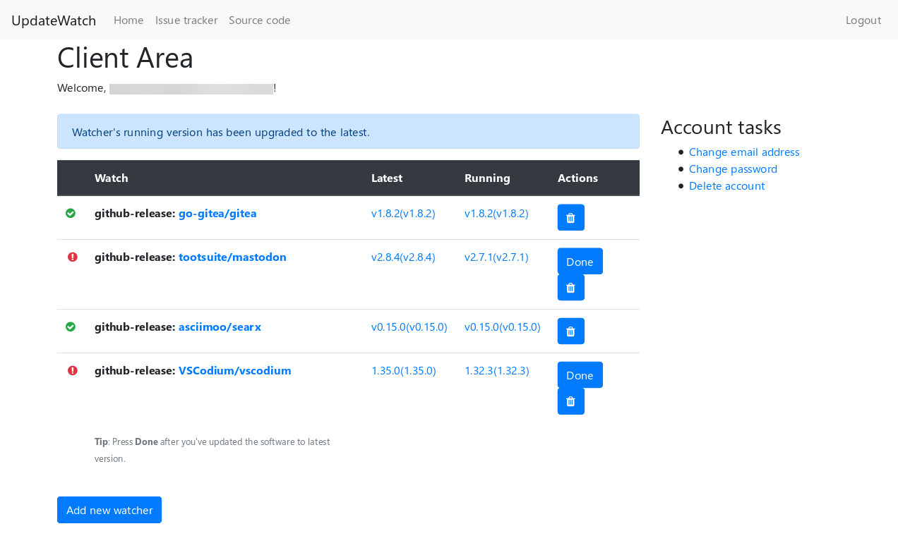

# UpdateWatch

Web-based utility that tracks software updates in one convenient place.

Hosted version available at [updatewatch.lelux.fi](https://updatewatch.lelux.fi/).

## Screenshots



## Running

```bash
composer install
cp .env.dist .env
yarn install
```

### Database setup

Make MariaDB database as described [here](https://wiki.lelux.fi/mysql/) and add the password to `.env`.

```sql
CREATE USER 'updatewatch_user'@'localhost' IDENTIFIED BY 'password';
GRANT ALL ON update_watch.* TO 'updatewatch_user'@'localhost' IDENTIFIED BY 'password';
```

```bash
sudo mysql -u root < db.sql
```
